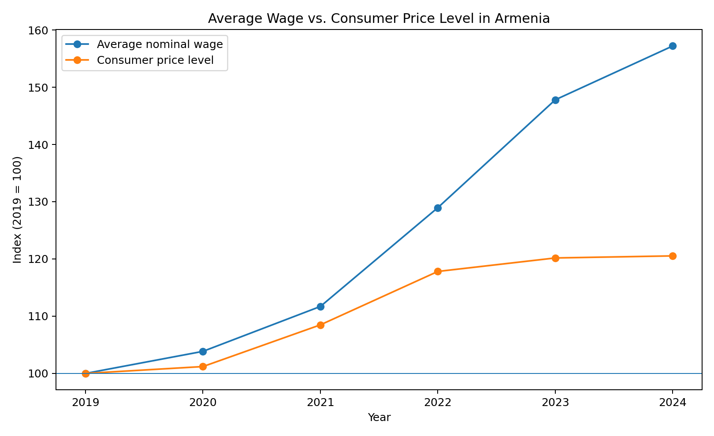
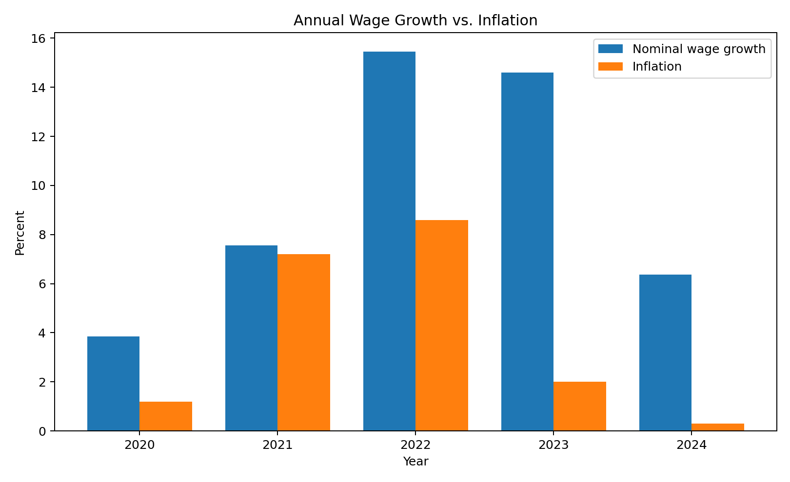
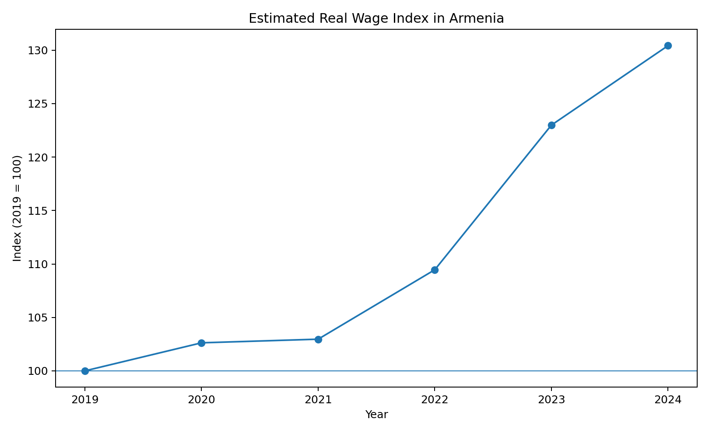
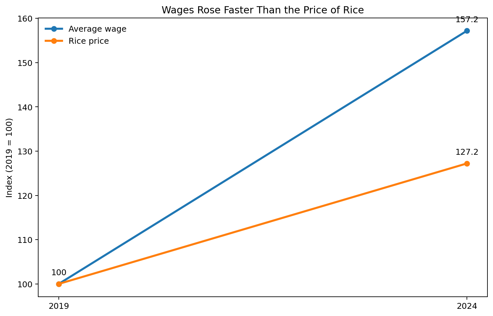
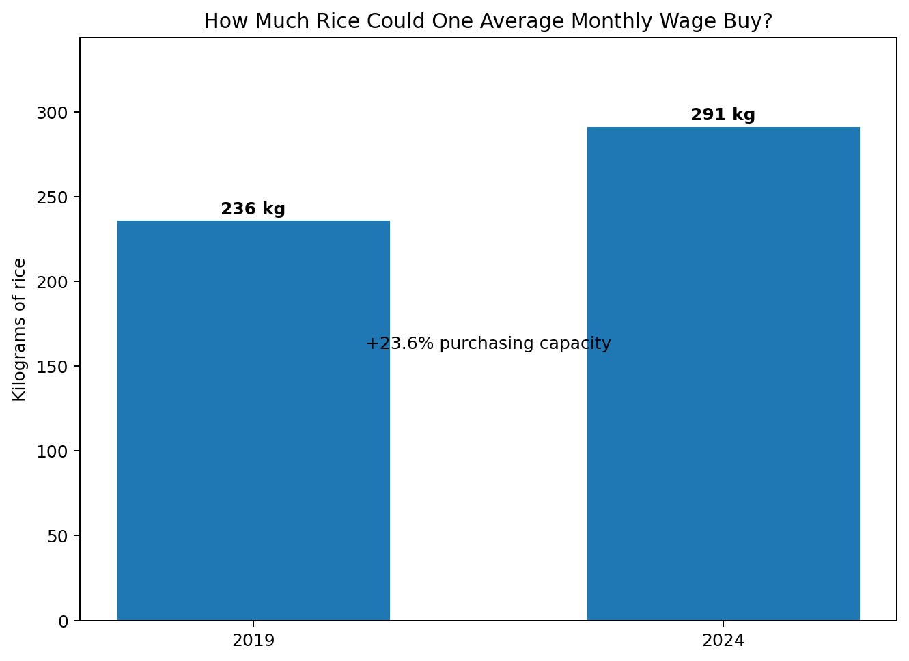

# Wages, Inflation, and Purchasing Power in Armenia, 2019–2024

## Research question

Did the growth of Armenia's average nominal wage between 2019 and 2024 translate into an increase in purchasing power after accounting for consumer-price inflation?

## Introduction

Changes in nominal wages alone do not show whether workers can afford more goods and services. If wages rise while prices rise at the same or a faster rate, the apparent increase in income may produce little improvement in real purchasing power. This project therefore compares Armenia's average monthly nominal wage with consumer-price inflation from 2019 to 2024 and constructs a simple real-wage index. It then uses a retail-price example to illustrate how the same framework can be applied to individual products.

The purpose is descriptive rather than causal. The analysis asks what happened to average wages and the general price level, not why those changes occurred.

## Data

The wage series comes from the Statistical Committee of the Republic of Armenia (Armstat). Average monthly nominal wages were AMD 182,673 in 2019, AMD 189,716 in 2020, AMD 204,048 in 2021, AMD 235,576 in 2022, AMD 269,994 in 2023, and AMD 287,172 in 2024.

Annual-average consumer-price inflation is also based on Armenian statistical data. The values used are 1.4% in 2019, 1.2% in 2020, 7.2% in 2021, 8.6% in 2022, 2.0% in 2023, and 0.3% in 2024.

For the retail-price illustration, the source material available for this project records rice at AMD 775 per kilogram in 2019 and AMD 986 in 2024.

## Methodology

Three indicators are used.

First, nominal wage growth is calculated as the percentage change in the average monthly nominal wage.

Second, a consumer-price index is constructed with 2019 = 100. Because 2019 is the base year, inflation from 2020 onward is compounded to estimate the change in the general price level relative to 2019.

Third, the nominal wage index is divided by the constructed price index to obtain a real-wage index:

`Real wage index = Nominal wage index / Consumer-price index × 100`

For the retail-price example, affordability is measured as the number of units of a product that one average monthly nominal wage could theoretically purchase.

## Wage and inflation dynamics

Between 2019 and 2024, the average monthly nominal wage rose from AMD 182,673 to AMD 287,172. This is an increase of approximately **57.2%**.

Inflation was relatively low in 2020, accelerated strongly in 2021 and 2022, and then slowed in 2023 and 2024. With 2019 set to 100 and annual-average inflation compounded from 2020 through 2024, the constructed consumer-price index reaches approximately **120.5** in 2024. This corresponds to an estimated cumulative price-level increase of about **20.5%** relative to 2019.

The comparison therefore shows that average nominal wages grew considerably faster than the constructed general price level over the full period.

## Annual wage growth versus inflation

The year-by-year comparison is important because the improvement was not uniform. Nominal wage growth was about 3.9% in 2020, 7.6% in 2021, 15.5% in 2022, 14.6% in 2023, and 6.4% in 2024.

Inflation was especially important in 2021 and 2022. Nevertheless, nominal wage growth exceeded annual-average inflation in each year from 2020 through 2024 in this dataset.

## Estimated real wage and purchasing power

The constructed real-wage index rises from 100 in 2019 to approximately **130.4** in 2024. In other words, after adjusting the average wage by the constructed consumer-price index, the result implies an increase of about **30.4%** in average wage purchasing power over the period.

This result should be interpreted carefully. It does not mean that every Armenian worker or household experienced a 30.4% improvement in living standards. The average wage can be influenced by changes in employment composition and high-wage sectors, while individual households face different consumption baskets, taxes, housing costs, and income sources.

## Retail-price case study: rice

Rice provides a simple product-level example. Its recorded price increased from AMD 775 per kilogram in 2019 to AMD 986 in 2024, a rise of approximately **27.2%**. Because the average nominal wage increased by 57.2% over the same period, the wage grew faster than the price of rice.

At the 2019 values, one average monthly wage was equivalent to about **235.7 kg** of rice. At the 2024 values, it was equivalent to about **291.2 kg**. On this narrow measure, rice affordability therefore improved by approximately **23.6%**.

The indexed comparison makes the relationship easy to see: with both series set to 100 in 2019, the average wage reaches 157.2 by 2024 while the rice-price index reaches 127.2.

Expressed as a physical quantity, one average monthly wage was equivalent to roughly 236 kg of rice in 2019 and 291 kg in 2024. The purpose of this calculation is not to suggest that households spend an entire wage on rice, but to provide an intuitive purchasing-power benchmark.

This product example is useful because it shows why general inflation and individual prices should not be treated as identical. Different products can move differently from the overall CPI.

## Key findings

1. Average monthly nominal wages increased by approximately **57.2%** between 2019 and 2024.
2. The constructed consumer-price level increased by approximately **20.5%** relative to the 2019 base.
3. The constructed real-wage index increased by approximately **30.4%**, indicating that average wages outpaced the general price level over the full period.
4. The improvement was not simply a result of low inflation: Armenia experienced substantial inflation in 2021–2022, but wage growth also accelerated.
5. In the available rice example, the product price increased more slowly than wages, producing an improvement in wage-based affordability.

## Limitations

The analysis has several limitations. Average wages do not represent the median worker and do not capture wage inequality. Gross wages are not disposable income. CPI represents an average consumer basket and may differ from the spending pattern of a particular household. The constructed real-wage index is an analytical estimate based on annual-average inflation and should not be presented as Armstat's official real-wage series. Finally, the retail-price section is a case study based on the product observation supported by the supplied source material, rather than a complete consumer basket.

## Conclusion

From 2019 to 2024, Armenia's average monthly nominal wage rose substantially faster than the estimated general consumer-price level. The resulting real-wage index suggests a meaningful increase in the purchasing power represented by the average wage over the full period. The retail-price example points in the same direction for rice: its price increased, but not as rapidly as the average wage.

The broader conclusion is not that inflation was unimportant. Inflation accelerated sharply in 2021 and 2022 and reduced the real value of nominal income growth. However, across the full 2019–2024 period, wage growth was large enough to exceed the cumulative increase in the constructed consumer-price index.

Future work could extend the analysis by adding a wider set of Armstat retail prices, comparing median and average wages, separating public- and private-sector wages, and examining differences across economic sectors.

## Sources

- Statistical Committee of the Republic of Armenia (Armstat), Average Monthly Nominal Wages / Salaries: https://sdg.armstat.am/8-5-1-a-iframe/
- ArmStatBank, Consumer Prices: https://statbank.armstat.am/pxweb/en/ArmStatBank/ArmStatBank__1%20Econnomy%20and%20finance__12%20Consumer%20Prices/
- Armstat retail-price table used during project preparation for the rice observation.
